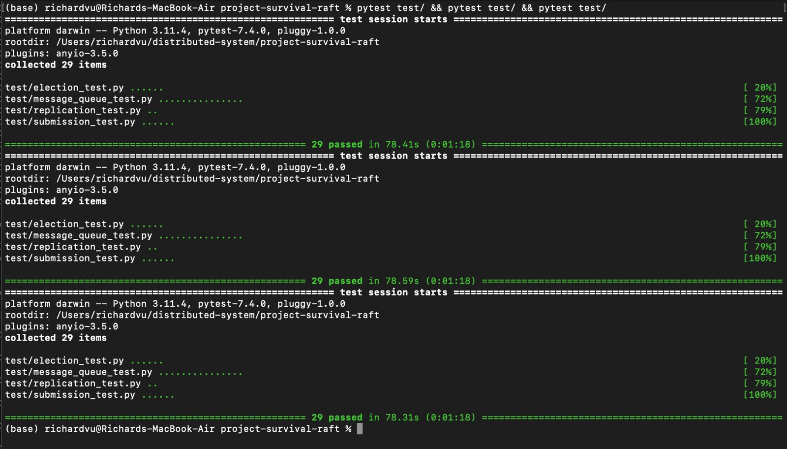

### Testing

### Message Queue:

- Created multiple topics using PUT operations and used GET to verify if all the topics are in the list.
- Added numerous messages into each topic and consumed messages for each topic to verify it.
- Ran the provided integrated tests.

### Election:

- Killed the leader to verify if the follower with the least timeout is actually becoming a candidate
and sending election requests.
- Using `/status` endpoint to find the existance of any duplicate leaders and also to check the state of the 
followers after the leader is elected.
- Checked if the followers are voting for candidates with lower term and outdated log.
- Ran the provided integrated tests.

### Fault Tolerance:

- Checked if the log and message queue is replicated between all the nodes.
- Checked whether the ensure-consensus algorithm is updating any outdated logs among followers.
- Slowly killed nodes one by one to verify the working of election algorithm until only half the nodes are remaining active.
- Tested to check if a new node that comes alive recognizes the existing leader.
- Checked if the an old leader than comes active again recognizes the new leader.
- Ran the provided integrated tests.

### Test cases Screenshot

